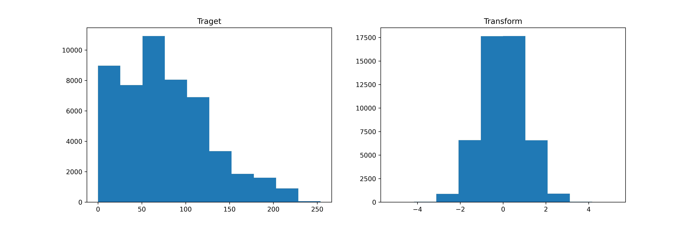
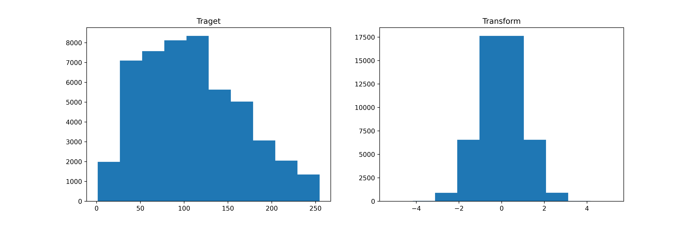

# Image Intensity Region Segmentation

## Results :- 
> Example 1

> Segment 3 intenstiy region
- low -> #CCE5FF
- medium -> #3399ff
- high -> #003366

> Example 2

> Example 3

## Transformation :-
Convert the Image to Normal Distribution
> Example 1

> Example 1

## Future Improvement
- Adding a Threeshold value which can be change to different standard deviation from the mean.
- Adding a Degree of Segmentation so the image can be segment on more than 3 number of intensity region.

